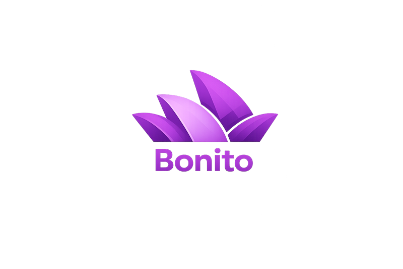
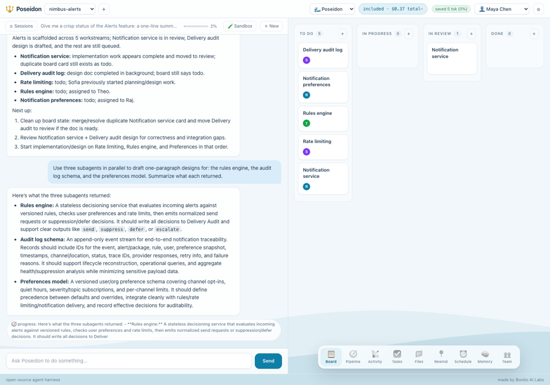
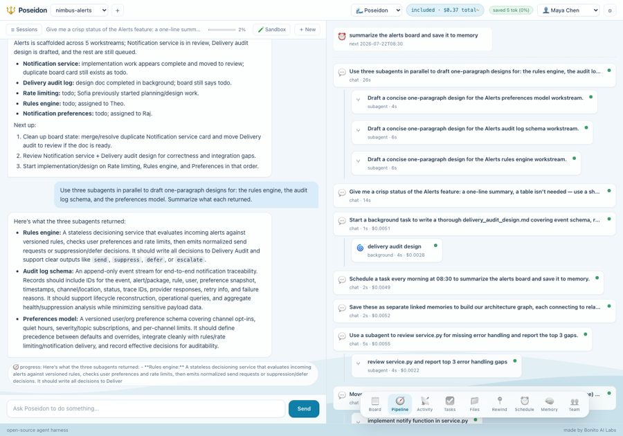
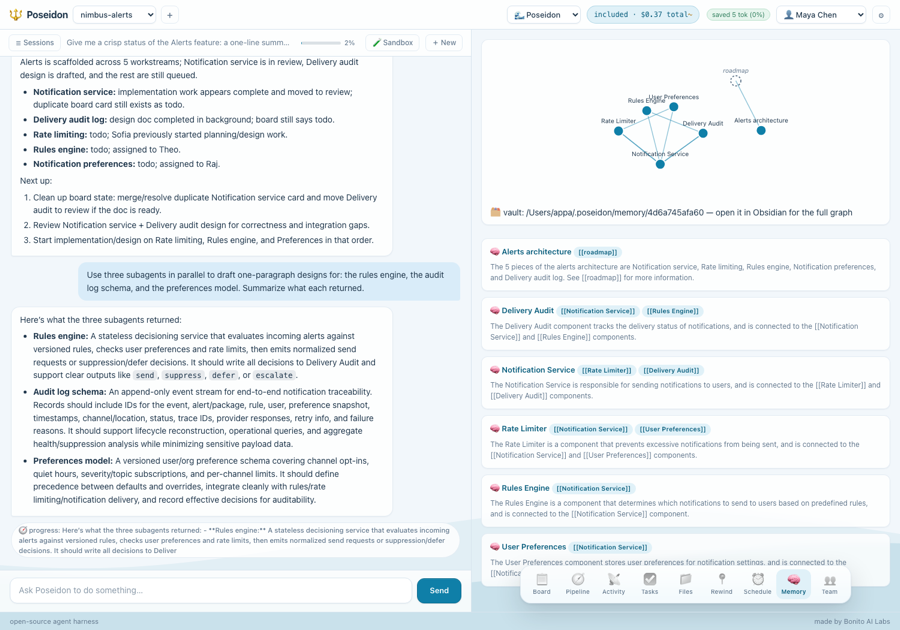
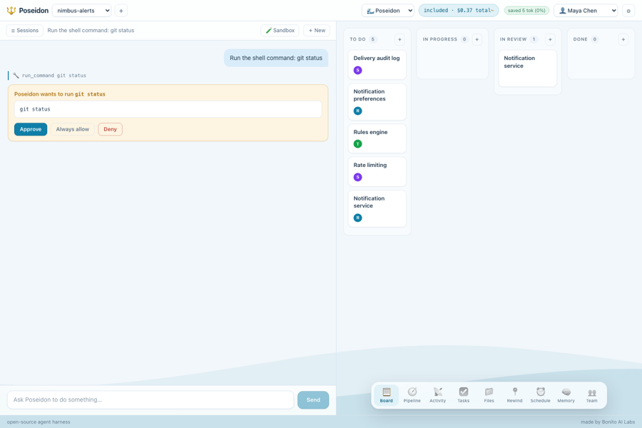

<p align="center">
  
  &nbsp;&nbsp;&nbsp;&nbsp;&nbsp;&nbsp;
  <a href="https://getbonito.com"></a>
</p>

<h1 align="center">🔱 Poseidon</h1>

<p align="center">
  <b>An open-source agent harness that opens as a chat in your browser.</b><br />
  Watch it work. Approve what matters. See what it costs.
</p>

<p align="center">
  Made by <a href="https://getbonito.com"><b>Bonito AI Labs</b></a>, the AI gateway for teams:
  one key for every provider, plus failover, cost tracking, and governance.
</p>

Most agent harnesses live in a terminal. Poseidon doesn't. One command installs it,
one command opens a chat on `localhost`, with a live workspace pane showing every
file it touches, every command it runs, and a running meter of what it's spending.

```bash
pipx install poseidon-ai
poseidon ~/my-project
```

Your browser opens. You talk. It works, visibly.

## See it work

|  |  |
|:--:|:--:|
|  |  |
| **Split-pane: chat on the left, live workspace on the right.** The work board, cost meter, and nav are always in view. | **Properly agentic.** Parallel subagents, background tasks, and scheduled runs, each with its own cost. |
|  |  |
| **Graph memory.** Durable facts stored as plain markdown with `[[wikilinks]]`, rendered as a graph you can open in Obsidian. | **The trust dial.** Every file write and shell command pauses for Approve, Always allow, or Deny. |

## Why another harness?

Three things the others don't do:

1. **Watch it work.** Split-pane UI: chat on the left, live workspace on the right,
   with an activity stream, a file browser, and every tool call visible as it happens.
   No claims in prose you can't verify; you see the hands moving.
2. **The trust dial.** File writes and shell commands pause and ask, inline in chat,
   with a preview. Hit *Always allow* and Poseidon earns that permission permanently.
   Autonomy is granted, not assumed, and it accumulates.
3. **It knows what it costs.** A live cost meter (per session, per model, tokens
   in and out) built into the header. No more waking up to a burned API budget.

And it's properly agentic, not just a chat with tools:

- **Plans first.** Multi-step work shows up as a live checklist in the workspace.
- **Subagents.** Big chunks get delegated to parallel subagents with their own context.
- **Schedules.** "Check this every morning" becomes a real scheduled run (approval-gated;
  unattended runs can only do what an *Always allow* rule already covers).
- **Memory.** Durable facts persist across sessions as plain markdown in
  `~/.poseidon/memory/`. Your agent's memory is your files: open it, edit it, delete it.

And because you stare at it all day: **skins**. Daylight waves (default),
Trek Wars (starfield + hyperjumps), Ukiyo-e (living woodblock waves), and
Wasteland (dunes, dust, the occasional tumbleweed). All hand-drawn vector, sharp
at any size.

## How Poseidon compares

A general comparison against the two categories most people already use. Terminal
coding agents vary a lot between tools, so ⚠️ means "some do, some don't."

| Capability | Poseidon | Terminal coding agents | Hosted agent platforms |
|:--|:--:|:--:|:--:|
| Visual browser UI, no terminal required | ✅ | ❌ | ✅ |
| Live workspace pane: see every file and command as it happens | ✅ | ❌ | ⚠️ |
| Inline approval cards + accumulating *Always allow* trust dial | ✅ | ⚠️ | ⚠️ |
| Live cost meter, per session and per model | ✅ | ⚠️ | ⚠️ |
| Parallel subagents | ✅ | ⚠️ | ✅ |
| Background tasks + scheduled runs | ✅ | ❌ | ⚠️ |
| Graph memory as a plain-markdown vault you own | ✅ | ❌ | ❌ |
| Any OpenAI-compatible model, including local Ollama | ✅ | ⚠️ | ❌ |
| Runs 100% local, keys never leave your machine | ✅ | ✅ | ❌ |
| Open source (MIT) | ✅ | ⚠️ | ❌ |

## Works with any model

Any OpenAI-compatible endpoint:

- **Ollama:** fully local, zero API key, free. Nous Hermes runs great.
- **OpenAI**, **Groq**, or any custom endpoint.
- **[Bonito](https://getbonito.com):** one key for every provider, with failover
  and team-level cost tracking.
- **Your ChatGPT subscription** *(experimental)*. "Sign in with ChatGPT" in
  Settings opens the normal ChatGPT sign-in in your browser (the same OAuth
  flow `codex login` uses), no API key and no account settings needed. On a
  remote/headless box use the device-code fallback instead, which is an
  OpenAI beta that must be enabled first (ChatGPT → Settings → Security →
  "Device code login"; workspace accounts: your admin turns it on). New and
  lightly tested; if it misbehaves, any of the endpoints above work.

Each preset carries the model's real context window, so long sessions
auto-summarize before the model's limit instead of erroring. The meter in
the toolbar shows how full the session is.

Keys are stored in `~/.poseidon/config.json` on your machine and sent nowhere else.

## Project instructions

Drop an `AGENTS.md` in your working directory and Poseidon reads it, the same
convention as every other harness. No new file formats to learn.

## Status

v0.5: the core loop (chat, file tools, shell with approvals, web fetch, cost
meter) plus task planning, parallel subagents, **background tasks**, scheduled
runs, **team projects** (profiles, shared sessions, handoff notes, status),
**automatic context compaction**, **checkpoints** (auto + rewind), persistent
project memory, and a **live Pipeline diagram** of everything running with
drill-down timelines. Architecture in [ARCHITECTURE.md](ARCHITECTURE.md);
roadmap in [PLAN.md](PLAN.md).

## Development

```bash
git clone https://github.com/ShabariRepo/poseidon
cd poseidon
python3 -m venv .venv && .venv/bin/pip install -e .
.venv/bin/poseidon --no-browser
```

## License

MIT. Made by [Bonito AI Labs](https://getbonito.com).
